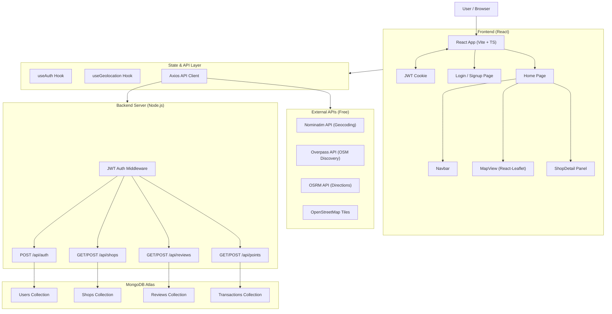

# ChaiPointer: Architecture & Implementation Decisions

This document tracks the major technical decisions, workarounds, and architecture choices made during the building and deployment of the ChaiPointer platform.

---

## 1. Map Provider Transition

**Problem:** 
The original implementation relied on Mapbox GL JS, which requires an active billing account and credit card for API keys. A completely free alternative was needed for development and deployment.

**Solution:** 
Replaced Mapbox with `react-leaflet` using public OpenStreetMap (OSM) tile servers. 

**Tradeoffs Made:** 
- **Visuals:** We lost Mapbox's polished vector maps, 3D terrain, and smooth camera animations. Leaflet uses raster tiles which are heavier and less customizable.
- **Performance:** Raster tiles can sometimes load slower than vector tiles depending on the OSM tile server load.

**Alternative for the Future:** 
Integrate **MapTiler** or **Ola Maps**. Both offer generous free tiers with vector tiles that look much closer to premium Mapbox/Google Maps styles without requiring immediate billing setup.

---

## 2. Geocoding & Address Autocomplete

**Problem:** 
Without Mapbox's Geocoding API, users couldn't search for cities or add new shops by typing addresses.

**Solution:** 
Integrated **Nominatim** (OSM's free open-source geocoding service). Added a 1-second debounce to the search input to comply with their strict rate limits.

**Tradeoffs Made:** 
- **Accuracy:** Nominatim relies strictly on OSM data and is less forgiving with typos or colloquial Indian address formats compared to Google or Mapbox.
- **Usage Limits:** The public Nominatim instance strictly enforces a limit of 1 request per second. Heavy traffic could result in the deployment being temporarily IP-blocked.

**Alternative for the Future:** 
Switch to the **Google Places API** or **LocationIQ**. They provide highly accurate, fuzzy-search capable autocomplete that handles Indian addresses exceptionally well.

---

## 3. The "Cold Start" (Empty Map) Problem

**Problem:** 
When a user opens the app in a new city (e.g., Lucknow or Delhi), the custom MongoDB database has no Chai spots, resulting in a completely empty, unengaging map.

**Solution:** 
Integrated the **Overpass API** to dynamically fetch real-world cafes and tea stalls directly from OpenStreetMap when the user pans/zooms on the map. These appear as "silver markers". Users can click them to "Claim" them, which saves them to our MongoDB database and unlocks the review/points system.

**Tradeoffs Made:** 
- **Query Complexity:** Initial attempts to fuzzy-search for the word "chai" over a 10km radius caused the Overpass server to timeout. We had to restrict the query to exact tags (`amenity=cafe`, `vending=coffee`) and limit fetching to when the user is zoomed in (Zoom Level >= 13).
- **Network Overhead:** Panning the map now triggers network requests to an external 3rd party server, which can slightly increase data usage and load times.

**Alternative for the Future:** 
Run a background script to **pre-seed our MongoDB database** by downloading OSM data extracts (via Geofabrik) for major Indian cities. This removes the reliance on the Overpass API during runtime and makes the app lightning fast.

---

## 4. Routing and Directions

**Problem:** 
Needed a way to draw navigation routes from the user's GPS location to a Chai Spot without the Mapbox Directions API.

**Solution:** 
Integrated the public **OSRM (Open Source Routing Machine)** API to fetch route coordinates and draw them as a Polyline on the Leaflet map.

**Tradeoffs Made:** 
- **Reliability:** The public OSRM server explicitly states it is for demo purposes only. Under production load, it may fail or rate-limit the app.

**Alternative for the Future:** 
Host a custom, lightweight routing engine on the backend using Docker (e.g., a small Valhalla or OSRM container), or use a dedicated routing service like **GraphHopper**.

---

## 5. Backend Deployment Build Path

**Problem:** 
During deployment, the backend server failed to start because the `start` script in `package.json` was looking for `dist/index.js`, but the TypeScript compiler nested the output under `dist/src/index.js`.

**Solution:** 
Updated the `package.json` start command to specifically target `node dist/src/index.js`.

**Tradeoffs Made:** 
- **Brittleness:** Hardcoding the `src` folder structure into the start script means if the folder architecture changes, the deployment script breaks again.

**Alternative for the Future:** 
Use a modern bundler like **esbuild** or **tsup** for the backend. This would compile the entire Express application into a single, flat `dist/index.js` file, resulting in faster cold starts and simpler deployment scripts.

---

## 6. Full System Architecture & User Flow

To help visualize the system, here is the complete architecture diagram (rendered via Mermaid) and the step-by-step user journey.

### Architecture Diagram (Mermaid)

### User Flow Breakdown

1. **Authentication:** Users land on the app and are redirected to `/login` if unauthenticated. Once logged in, a JWT session is established via HTTP-only cookies.
2. **Map Discovery:** The `Home` page loads a fullscreen Leaflet map. It fetches user GPS coordinates and loads known shops from MongoDB. 
3. **Cold Start Mitigation:** As the map is panned, the app dynamically queries the external **Overpass API** to discover real-world cafes from OpenStreetMap and displays them as "unclaimed" markers.
4. **Interaction:** Clicking an unclaimed shop allows the user to "Claim" it, saving it to MongoDB. Users can then leave 1-5 star reviews, earning points for their contribution.
5. **Navigation:** Clicking "Get Directions" uses the **OSRM API** to draw a polyline route directly on the map from the user's location to the chai shop.
